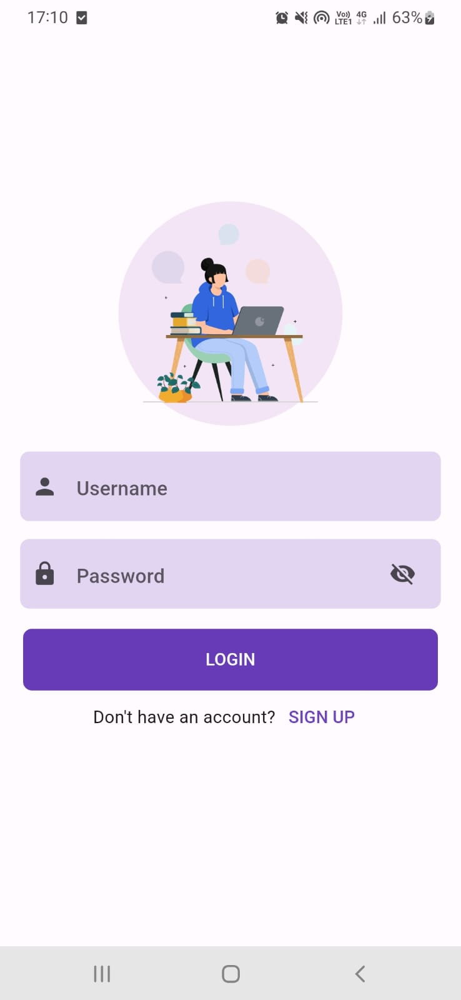
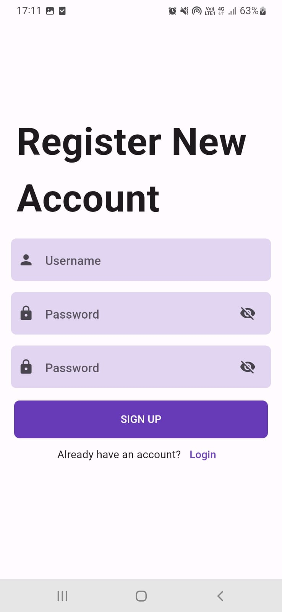
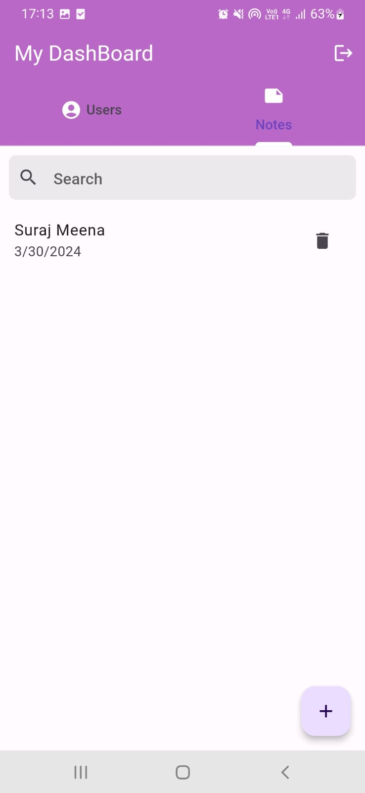

# Sqflite Authentication

This repository containing sqflite authentication with login, signup and sqflite CRUD operations.

If you found this projects useful, then please consider giving it a ⭐ on Github and sharing it with your friends via social media.

## 🛠 Languages and Tools:

 
 
 

## 🚀 About Me
Hi, I'm Suraj Meena! 👋
------------------------------------------------
A Passionate Flutter Developer

## 🔗 Connect with me

## Lessons Learned

What did you learn while building this project? 

✅ Flutter UI and Design Basics

✅ CRUD Operations Using Sqflite 

✅ Sqflite Authenticatio

## ScreenShots

 |   
 
 |  

## Get started with Flutter!

A few resources to get you started if this is your first Flutter project:

- [Lab: Write your first Flutter app](https://docs.flutter.dev/get-started/codelab)
- [Cookbook: Useful Flutter samples](https://docs.flutter.dev/cookbook)

For help getting started with Flutter development, view the
[online documentation](https://docs.flutter.dev/), which offers tutorials,
samples, guidance on mobile development, and a full API reference.
